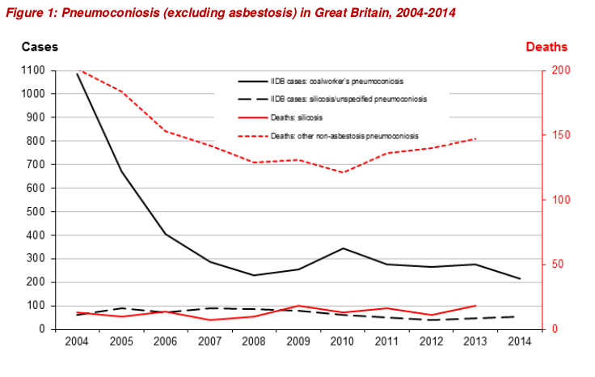
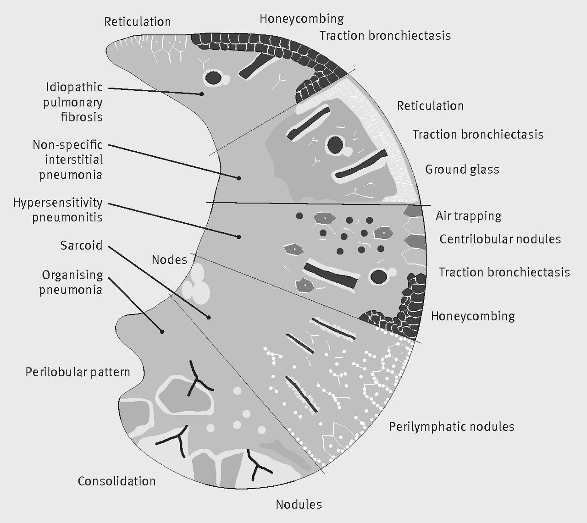
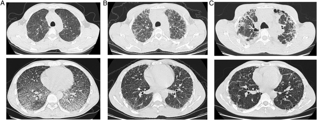
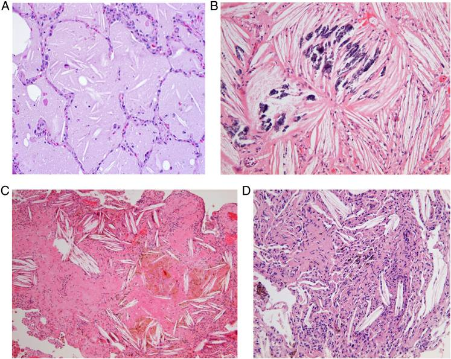

% Work-related Interstitial Lung Disease: Beyond pneumoconiosis 
% Dr Carl Reynolds 

# Disclosures

## I have nothing to disclose 

# Supporting materials

##
- talk available online 

> http://carlreynolds.net/work-related-ild-talk-sanfran-march-2017/

- additional material available

> https://github.com/drcjar/work-related-ild-talk-sanfran-march-2017

# Beyond pneumoconiosis?

##

##

 

##

# What is work-related ILD? 

## Definitions

## work-related doesn't mean occupational

##

- occupational diseases are primarily caused by exposure to risk factors arising from work
- work-related diseases have multiple causes; factors in workplace may play a role 
(WHO 2017)

## diffuse parenchymal lung disease is confusing

##

- ILD or DPLD
- heterogeneous group of disorders characterised by inflammation and fibrosis of the interstitium
- interstitium refers to tissue between the pulmonary alveoli and the bloodstream
- in practice disease can also involve airway

## 

{ width=65% }

##

{ width=65%}

## lung physiology and interstitial exposures 

## 

- Diffusion of gases across blood-gas barrier is passive and governed by Fick's Law.

##

{ width=50% }

##

> Vgas (diffusing) is proportional to Area/Thickness * D(diffusion constant) * (P1 - P2)

D = solubility / root of the molecular weight of the gas

##

{ width=65% }

##

- 2μm across (for ref sheet of paper is 50μm, 1/20th of a mm or 0.05mm). (17)
- 25x thinner than that. 300 million alveolii. 
- Each alveoli is 0.0042mm^3 (a grain of sand is 0.06mm^3, so an alveoli is about 14 times smaller).(16) Surface area of a tennis court.
- basic tripartate layout highly conserved throughout evolutionary history (alveolar epithelium, ECM, capillary endothelium, seen American lungfish arising some 400 million years ago) (18)

## 

> TV 500ml, dead space 150ml, RR 15/min, 350ml*15 = approx 5L/min -> 7200L/day 

## ample opportunity for sufficiently small particles to meet the interstitium 

## 

- particles > 2μm in diameter deposit in the larger airways
- particles 1-2μm the smaller conducting airways
- particles 0.1-1μm deposit in the alveolar-interstitial region

## {data-background="images/particles.png"}

##

- the 0.1-1μm range includes paint pigments, metal dusts, and humidifier particles   
- responses to exposure can be divided e.g irritant/fibrotic/allergic/infectious/carcinogenic

## work-related ILD

## ILD incidence 30/100,000 per year 

## ILD prevalence 70/100,000 

##

- precise population prevalence and incidence of ILD hard to establish (classification 
problems, limitations of registry and insurance claim data).
- best historic estimate of incidence 30/100,000 per year, prevalence 70/100,000. (10)
- IIP most common, IPF 1/3rd of cases, more common in men.

## 15-20\% of ILD due to occupational and environmental exposures

## aetiologies are many  

##

- common: include organic antigen, isocyanates, silica, cadium, diacetyl, asbestos
- less common: cobalt, rare earths, plutonium 

## 

{ width=90% }

## relationship between aetiolgic agent and pathological patten often not 1:1

##

{ width=90% }

## Clinical features 

- Respiratory symptoms with an appropriate occupational or environmental exposure history 
- Host-factor (e.g adaptive immune response, systemic) vs exposure factor dominant presentations (local inflammatory response)
- Investigations

## Attribution frequently non-trivial

## New workplace and environmental exposures all the time

## 

{ width=90% }

# Recent outbreaks

## Three recent outbreaks 

##

1. Ardystil 
2. Indium tin oxide
3. South Korean lung 

# Ardystil

## 

- April 1992, two young women who worked at a textile factory were treated for interstitial lung disease and severe pulmonary insufficiency in Valencia.
- Prompted investigation of all textile factories (A-H) using same spraying technique in the area
- 257 employees identified. 22 cases who met radiological and biopsy criteria for organising pneumonia. Six fatal cases.

##

- Factory A had the highest risk of being a case (RR=24.3; 95% Cl=5.7-104.4),
followed by Factory B (RR=11, 95% CI=11.9- 62.9) and only two out of 22 cases
had never worked in factories A or B. 
- It was found that only in factories A and B had the presence of an airborne chemical by the trade name Acramin FWR that had recently been substituted with another related compound Acramin
FWN. 
- Subsequently a similar outbreak occurred in Algeria.

##

{ width=65% }

##

{ width=65% }

##

{ width=65% }

##

- Acramin FWR (tradname Ardystil) recently introduced as a replacement for Acramin FWN at the two factories where majority of cases had worked. 
- Animal studies confirmed respiratory toxicity.
- Thought that highly negatively charged long-chain molecular structure of Acramin FWN contributes causes toxicity.

# Indium tin oxide

##

- Indium tin oxide (ITO) is a sintered material used in making crystal displays for televisions and computers.
- First case of ITO-associated interstitial pneumonitis was reported in 2003 in a 27-year-old Japanese worker (1)
- Cases in Japan, US, and China confirm interstitial pneumonia similar to UIP, emphysema, PAP in indium workers. Two patients have died to date. (13) 
- Like Ardystil outbreak notable that cases are young, have severe respiratory disease, and colleagues who are also unwell.

##

{ width=65% }

##

{ width=65% }

# South Korean Lung

##

{ width=65% }

##

- Household clustering was observed in a series of patients admitted to ICU with severe respiratory distress in the spring of 2011. (15)
- Case series consisted of 17 patients (15 of which were female) with median age 35. Six were pregnant at presentation. 
- All presented with cough and dyspnoea. CT showed patchy consolidation followed by ground glass opacity and bronchiolocentric fibrotic changes.  
- Ten patients required mechanical ventilation. Four had lung transplants. Five of the six who did not have a lung transplant died.

##

- An infective aetiology was initially suspected.
- Epidemiological investigation (a hospital based case-control study) revealed that all patients had used humidifier disinfectant in their homes. 
- It transpired that children had also been affected.

##

- From 2006 epidemics of fatal lung injury in children were observed in Korea every spring (14).
- Clinical characteristics of suspected cases between 2006-2011 were reviewed and association with humidifier disinfectant use made.
- 138 cases, average age 30.4 months. 80 children died.
- No new cases following humidifier disinfectant ban in 2011. 

##

- Mechanism by which polyhexamethylene guanidine phosphate, poly(oxyalkylene guanidine) hydrochloride, chloromethylisothiazolinone/methylisothiazolinone (toxic materials within humidifier disinfectant) not yet known. 
- Avoidable? Writing about 'Humidifier fever' in Parke's third edition (1994) Pickering stated (use of humidifier biocides) "should be discouraged because we have no knowledge of the effects of long-term exposure to this group of chemicals"

##

{ width=65% }

##

{ width=65% }

##

# MCQs

## Which of the following is true of the anatomy of the lung? 

##

 A) The blood gas-barrier is approximately 1/25th of the thickness of a sheet of paper.
 B) It's estimated that the average adult has 300 million alveoli.
 C) The volume of an alveoli is 14 times that of a grain of sand.
 D) All of the above.

## Which of the following is true of South Korean lung?

##

 A) It predominantly affected women and children.
 B) Most adult patients did not require mechanical ventilation. 
 C) An infective aetiology was not initially suspected.
 D) It has not resulted in legal proceedings. 

## Which of the following is true of Indium Lung?

##

 A) Cases have reported in China, Japan, and Korea.
 B) It is characterized by a single distinct pathological appearance.
 C) Disease onset typically occurs after age 60. 
 D) Several pathological appearances are associated with Indium Lung.

# Summary 

##

1. Occupational and environmental exposures change over time giving risk to new disease outbreaks; the interstitium is vulnerable 
2. Recent occupational and environmental interstitial lung disease outbreaks include Ardystil, Indium tin oxide, and South Korean lung
3. The relationship between exposures and pathological patterns is frequently not 1:1
4. Stay vigilant 

# Questions?

## Questions and contact

- carl.reynolds@imperial.ac.uk
- www.carlreynolds.net

# References

##

1. Cullinan, Paul, et al. "Occupational lung diseases: from old and novel exposures to effective preventive strategies." The Lancet Respiratory Medicine (2017).
2. Reynolds CJ, Blanc PD. Organising Pneumonia and Other Uncommon Interstitial Disorders in Parkes’ Occupational Lung Disorders. CRC Press; 4th edition.
3. Litow, Francesca K., et al. "Occupational interstitial lung diseases." Journal of occupational and environmental medicine 57.11 (2015): 1250-1254.
4. Glazer, Craig S. "Occupation, avocation, and interstitial lung disease." Clinical Pulmonary Medicine 18.1 (2011): 20-28. 
5. Wallis, Adam, and Katherine Spinks. "The diagnosis and management of interstitial lung diseases." Bmj 350 (2015): h2072.

##

6. Travis, William D., et al. "An official American Thoracic Society/European Respiratory Society statement: update of the international multidisciplinary classification of the idiopathic interstitial pneumonias." American journal of respiratory and critical care medicine 188.6 (2013): 733-748.
7. King TE. Approach to the adult with interstitial lung disease: Clinical evaluation. In: UpToDate, Post, TW (Ed), UpToDate, Waltham, MA, 2015.
8. West, John B. "Role of the fragility of the pulmonary blood-gas barrier in the evolution of the pulmonary circulation." American Journal of Physiology-Regulatory, Integrative and Comparative Physiology 304.3 (2013): R171-R176.

##

9. McNulty, William, and Omar S. Usmani. "Techniques of assessing small airways dysfunction." European clinical respiratory journal 1 (2013).
10. Coultas, David B., et al. "The epidemiology of interstitial lung diseases." American journal of respiratory and critical care medicine 150.4 (1994): 967-972.
11. Tarlo, Susan, Paul Cullinan, and Benoit Nemery, eds. Occupational and environmental lung diseases: Diseases from Work, Home, Outdoor and Other Exposures. John Wiley & Sons, 2011.
12. Hoet, P. H., et al. "In vitro cytotoxicity of textile paint components linked to the" Ardystil syndrome"." Toxicological Sciences 52.2 (1999): 209-216.

##

13. Cummings, Kristin J., et al. "Indium lung disease." CHEST Journal 141.6 (2012): 1512-1521.
14. Kim, Kyung Won, et al. "Humidifier disinfectant–associated children’s interstitial lung disease." American journal of respiratory and critical care medicine 189.1 (2014): 48-56.
15. Hong, Sang-Bum, et al. "A cluster of lung injury associated with home humidifier use: clinical, radiological and pathological description of a new syndrome." Thorax (2014): thoraxjnl-2013.
16. http://ccnmtl.columbia.edu/projects/mmt/frontiers/web/chapter_2/8918.html
17. West, J. B., and O. Mathieu-Costello. "Structure, strength, failure, and remodeling of the pulmonary blood-gas barrier." Annual review of physiology 61.1 (1999): 543-572.i

##

18. West, John B. "Thoughts on the pulmonary blood-gas barrier." American Journal of Physiology-Lung Cellular and Molecular Physiology 285.3 (2003): L501-L513.
19. Feary, Johanna R., and Joanna Szram. "Occupational Hypersensitivity Pneumonitis: What Is the Evidence, When to Think of It, and What to Do." Clinical Pulmonary Medicine 23.1 (2016): 23-29.
